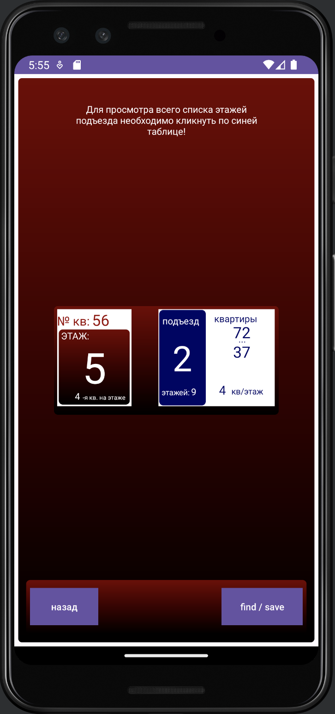
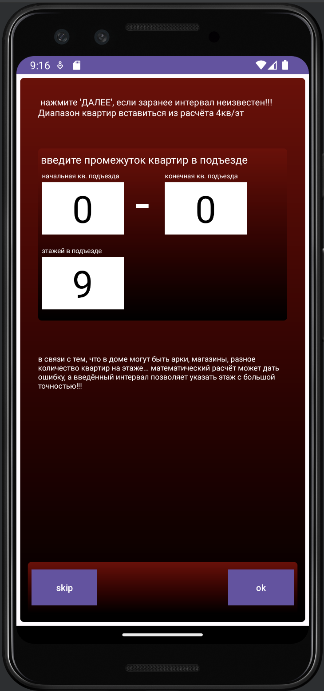
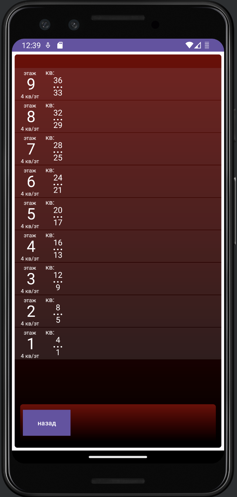

# FlatOn

Calculate The Stage Of The Flat

# BackEnd Node.js Nest.js App

<a href="https://github.com/addamsv/FlatOn/tree/backend-nest-prod">Backend Nest.js Branch</a>

# Android App

<a href="https://github.com/addamsv/FlatOn/tree/android-prod">Android Branch</a>

