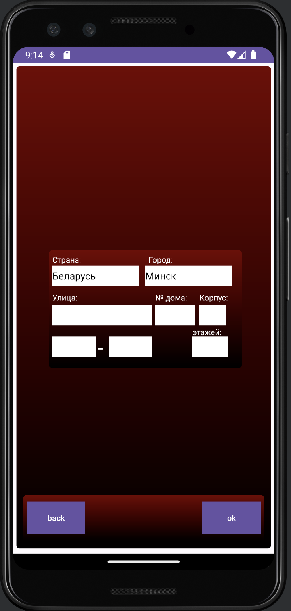
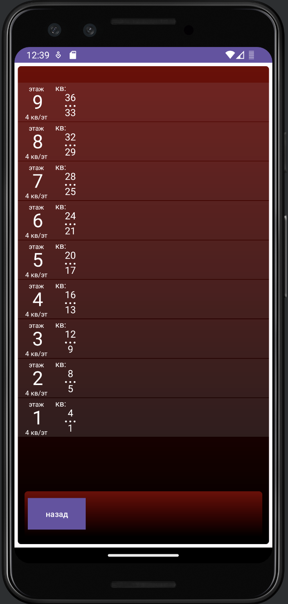

  <h1>На каком этаже квартира</h1>
  Заказ моего товарища, занимающегося замером дверей, которому часто приходится ездить по различным адресам
    
  приложение вычисляет этаж по таким данным как № первой квартиры в подъезде, № подъезда...
    
  <h2>Android App</h2>
  

  
  
  
   
     
  
  
  
  <h2>Backend Nest.js App</h2>
  

    
  

  
    

  <h2>Backend Java Spring Boot App</h2>
  

    
  

